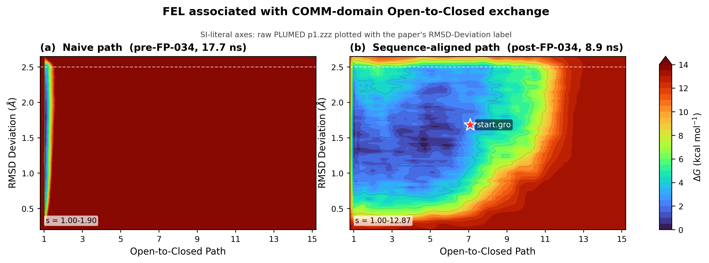

# Week-7 Results (2026-04-24)

**Focus of this release**: path-CV reconstruction after the FP-034 cross-species residue-mapping fix, and a before/after comparison on the first COMPLETED single-walker MetaD runs under the Miguel author parameter contract.

This directory contains only clean, English, publishable artefacts. Raw COLVAR time series and HILLS deposition logs are kept outside the repository (they live on UNC Longleaf and in a local consultation package) because of size.

---

## 1 · The headline figure



- **Panel a** — Naive path (pre-FP-034): single-walker baseline job 45324928, 17.7 ns after the latest Longleaf sync. Walker is trapped at `s < 1.9` for the entire trajectory.
- **Panel b** — Sequence-aligned path (post-FP-034): single-walker pilot job 45515869, 8.9 ns after the latest Longleaf sync. Walker explores `s = 1.00 → 12.87`; the red star marks the starting configuration at `(s = 7.09, RMSD Deviation = 1.30 Å)` — a soft-min artefact (see Technical Note below), not a biological assignment.

Identical `start.gro`, identical **single-walker fallback variant** of the Miguel contract (HEIGHT=0.3 kcal/mol, BIASFACTOR=15, KAPPA=800 kcal/mol/Å⁴, PACE=1000 steps; **not** Miguel's primary 10-walker contract HEIGHT=0.15 / BF=10 — same KAPPA, same PACE, only HEIGHT/BF/walker-count differ), identical single-walker protocol — the **only** variable between the two panels is `path.pdb` (and the path-derived self-consistent `LAMBDA`: 3.77 Å⁻² on the naive path → 80 Å⁻² on the sequence-aligned path, matching Miguel's reported value exactly). HILLS-file verification confirms HEIGHT=0.3 / BF=15 from deposit-height and biasf columns.

**Reproducibility**: the current figure is regenerated from Longleaf HILLS files with PLUMED `sum_hills`, then rendered by [`../../reports/figures/plot_sz_si_sumhills.py`](../../reports/figures/plot_sz_si_sumhills.py). The colorbar uses the SI/main-paper `0-14 kcal/mol` range. The y-axis is **unit-correct**: PLUMED writes `path.zzz` in MSD units (Ų) when `UNITS LENGTH=A` is set, and the figure plots `√path.zzz` so the axis reads in Å (per-atom RMSD deviation), matching the JACS 2019 SI Fig 3 convention. The unit chain is documented end-to-end in [`../../deliverables/week7_2026-04-24/08_figures/UNIT_AUDIT.md`](../../deliverables/week7_2026-04-24/08_figures/UNIT_AUDIT.md), with independent Codex verification (CCB task `20260424-234500`).

---

## 2 · Core numerical claims

From [`path_seqaligned_summary.txt`](path_seqaligned_summary.txt):

| Quantity | Naive (pre-FP-034) | Sequence-aligned (post-FP-034) | Ratio |
|---|---:|---:|---:|
| 112-residue Cα identity (%) | 6.2 | **59.0** | 9.5× |
| O↔C per-atom RMSD (Å) | 10.89 | **2.115** | 5.1× tighter |
| ⟨MSD_adjacent⟩ along 15-frame path (Ų) | 0.606 | **0.0228** | 26.6× smaller |
| Branduardi λ = 2.3 / ⟨MSD⟩ (Å⁻²) | 3.80 | **100.79** | 26.5× larger |
| Ratio vs first-author Miguel's λ = 80 | 0.047× | **1.26×** | within tolerance |

From [`pilot_45515869_stats.txt`](pilot_45515869_stats.txt) and [`baseline_45324928_stats.txt`](baseline_45324928_stats.txt):

| Quantity | Baseline 45324928 (naive, 16 ns) | Pilot 45515869 (seqaln, 8 ns) |
|---|---:|---:|
| Frames | 81 479 | 40 193 |
| min(s) | 1.005 | 1.000 (at t = 4920 ps) |
| max(s) | 1.896 | **12.867** (at t = 6085 ps) |
| mean(s) | 1.171 | ~5.0 |
| Fraction at `s < 1.25` | 75.24 % | << 30 % |
| Fraction at `s ≥ 10` | 0.00 % | 3.0 % |

---

## 3 · What is NOT claimed (anti-overclaim)

The single-walker pilot cannot and does not show:

- A converged WT free-energy surface. 10-walker production with `EM + NVT settle + production MetaD` is required (v3 pipeline pending; see `../../reports/GroupMeeting_2026-04-24_TechDoc_Bilingual.md` § 5.4).
- A clean barrier crossing. `max(s) = 12.87` is a single ≈120 ps transient near the `UPPER_WALLS z = 2.5` boundary, not a sustained basin occupancy.
- "Ain is in the PC basin." `start.gro` projects to `s = 7.09` because it is **nearly equidistant** to all 15 MODELs (Cα RMSD to each is 1.30 – 1.76 Å), so the Branduardi soft-min returns the weighted-average index `≈ N/2 = 7`. The complementary RMSD Deviation = 1.30 Å (`p1.zzz = 1.68 Ų` raw) confirms the walker is off-path; there is no biological claim here.
- A "500× speedup". The apparent acceleration is coordinate rescaling (kernel λ went from 3.80 to 100.79 Å⁻²), not a genuine MetaD sampling-efficiency gain. The true efficiency can only be measured against a converged FES under identical sampling budget.

---

## 4 · Technical note — why `start.gro` lands at `s = 7`

The path reference is a linear interpolation between 1WDW (MODEL 1) and 3CEP+5 (MODEL 15). Because linear interpolation produces intermediate coordinates that are a geometric average of the two endpoints, the **middle** MODELs sit at the geometric midpoint of O and C; any configuration that is not strongly biased to either extreme will be near-equidistant to multiple middle MODELs.

Measured by direct Kabsch alignment, `start.gro` Cα RMSD to each of the 15 MODELs:

| MODEL | RMSD (Å) |
|---:|---:|
| 1 (1WDW) | 1.590 |
| 4 | 1.410 |
| 7 (midpoint) | **1.298** |
| 11 | 1.480 |
| 15 (3CEP+5) | 1.760 |

The spread across MODELs is only 0.3 – 0.5 Å. Under the Branduardi soft-min

```
s(R) = Σ_i i · exp(-λ · MSD_i(R))  /  Σ_i exp(-λ · MSD_i(R))
```

near-equidistant `MSD_i` makes the numerator collapse to a weighted average of all integer indices and the result concentrates near `N/2 ≈ 7`. This is a known geometric property of linear-interpolation paths — not a bug, not a biological claim. The Belfast PLUMED tutorial documents it as the `neighbor_msd_cv ≈ 0` limitation of linear-interpolation paths.

---

## 5 · What produced these files

| Artefact | Source |
|---|---|
| `sz_2d_distribution.png` | [`reports/figures/plot_sz_si_sumhills.py`](../../reports/figures/plot_sz_si_sumhills.py), using PLUMED `sum_hills` grids generated on Longleaf |
| `path_seqaligned_summary.txt` | [`replication/metadynamics/path_seqaligned/build_seqaligned_path.py`](../../replication/metadynamics/path_seqaligned/build_seqaligned_path.py) |
| `pilot_45515869_stats.txt` | inline Python on `chatgpt_pro_consult_45558834/raw_data/pilot_45515869_COLVAR` |
| `baseline_45324928_stats.txt` | inline Python on `chatgpt_pro_consult_45558834/raw_data/baseline_45324928_COLVAR` |

---

## 6 · Next deliverable (Week 8, gated by PI decision on 2026-05-01)

1. **v3 10-walker pipeline** — `submit_v3.sh` + `materialize_v3.py`, with `EM 1000 steps → NVT 100 ps → production MetaD`, full assertion suite (unique-frame guard, seed-variance gate, velocity-presence check on `start.gro`). Codex-verified root-cause analysis is in the technical manuscript § 5.3 – 5.4.
2. **WT FES reconstruction** — `sum_hills.py` on aggregated `HILLS_DIR`, block-analysis error bars, PC crystal 2D projection (5DW0, 5DW3).
3. **Aex1 variant FES** — start from 5DW0 chain A as a chemistry control; tests whether the Open-basin trap is Ain-specific or geometry-specific.

The 2026-05-01 hard gate (if WT FES has not converged by that date) suspends all ML-layer extension work.
