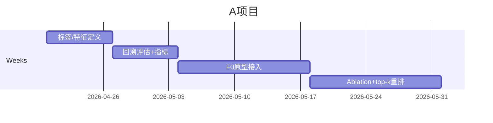

# TrpB 项目可 owner 项目结论

## Executive Diagnosis

**结论**：你现在最该 owner 的不是 MetaD 复现，也不是 generic dynamics/RNO，而是 **TrpB-specific objective layer**：把 **D/L selectivity + catalytic progression + false-positive control** 做成会改变 ranking/decision flow 的 **F0 evaluator**。  
**直证**：Slack 反复指向同一痛点：GRPO 可能因 wrong rewards 产出 false positives（435–450）；当前 reward 未覆盖全程、reprotonation 决定立体化学（603–609）；Amin 明说 reward 必须 **independent of alignment**（828–829）；当前计划是 **F0 quick signals→GRPO，F1/F2→MFBO**（1041–1043）。MetaD 仅被表述为 OpenMM benchmark（1128）；protein dynamics 被放在 SURF side project（1152–1153）。STAR‑MD 做的是 **generic long-horizon trajectory generation**；Osuna/ SI 的 MetaD 是重型 FEL protocol，不适合你当前 owner 主线。  
**推断**：最有 sponsor 的问题是“如何更可靠地筛 candidate”，不是“再造一个 model”。  
**假设**：你可拿到 RFD3 outputs、MD/MMPBSA结果、F0代码。

## Concrete Ownerable Projects

| 项目 | 你解决什么 | 1–2周 | 1–3月 |
|---|---|---|---|
| **A. Alignment-independent F0 evaluator** | 用 D/L docking gap、Lys 可达性、proton donor/acceptor 几何、product-side sanity 改 ranking；**非 STAR‑MD**：不是 trajectory，是 TrpB objective | retrospective：对已有候选算特征，指标看 **Precision@k / top-k hit enrichment / AUCPR** 是否优于当前 ranking | 接入 F0/GRPO；证明 top 20 更富集于 MD-stable / 更好 MMPBSA |
| **B. False-positive calibration layer** | 建 cheap-signal→late-signal 映射；决定哪些信号只能进 MFBO 而不能进 GRPO | 建 failure labels（broken geometry / dissociation / weak binding / wrong stereochem proxy） | 输出 gating policy；改变送湿实验名单 |
| **C. Minimal multi-state scorer** | 只选 2–3 个关键 state，不做 full MetaD；**非 STAR‑MD**：是 catalytic-state screening | 定义反应坐标+theozyme/state schema | PLACER/F0 scorer 原型 |

**避免**：full MetaD、generic RNO/dynamics、纯 clustering/taxonomy、Y301 纯机理解释。前两者慢且 sponsor 弱；后两者多是 supporting 或易被 Yu/Amin 吸走。  
**A 最适合你**：不是 Yu 自然会做的 MD/DFT，也不是 Amin 已在 owner 的 generator；它是 interface/task-definition 层，最能形成你的独特贡献。

## Harsh Eliminations

**直证**：MetaD 当前只是 benchmark（1128）；dynamics 是 SURF side work（1152–1153）。  
**推断**：clustering、memo、audit 若不改变 ranking，只是 useful support；Y301-only 机理会被 Yu 吸走；generic dynamics 会被 STAR‑MD 压住。

## Final Ranking

**综合排序**：A > B > C。  
A：重要性、Anima/PI buy-in、Amin 支持、你的 ownership 都最高。  
B：最快出结果，最适合 1–2 周。  
C：有 paper 味，但 setup 风险更大。

## 1–3 month timeline

## Meeting script + 5 questions

**脚本**：  
“我想把主线定成 **TrpB objective correction**，不是继续押 MetaD 或 generic dynamics。Slack 里现在最稳定的痛点是 wrong rewards、alignment dependence，以及 reward 没覆盖 D/L selectivity 和 stage-wise progression。我想 owner 一个 **alignment-independent F0 evaluator**：先用已有 RFD3/MD/MMPBSA 结果做 retrospective calibration，验证哪些 cheap signals 真能减少 false positives，再把有效信号接到 GRPO 或至少 F0/MFBO。这样我做的不是 audit，而是直接改变 candidate ranking 和后续 wet-lab 决策。”  

**问 Amin**：  
- 我可用哪些 retrospective labels？  
- 这层东西最终进 GRPO 还是先只进 MFBO/F0？  
- 成功标准是 **top-k enrichment** 还是必须 code integration？  
- 当前谁 owner 数据清单与接口？  
- 若 cheap proxies 无增益，是否及时 stop 而不继续堆 heuristic？